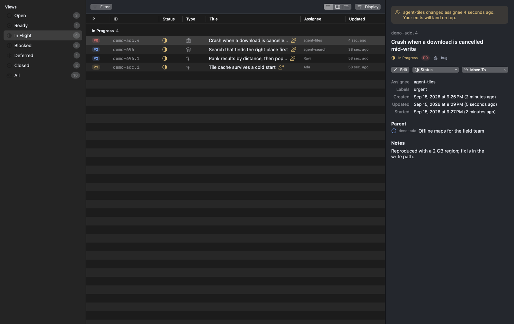
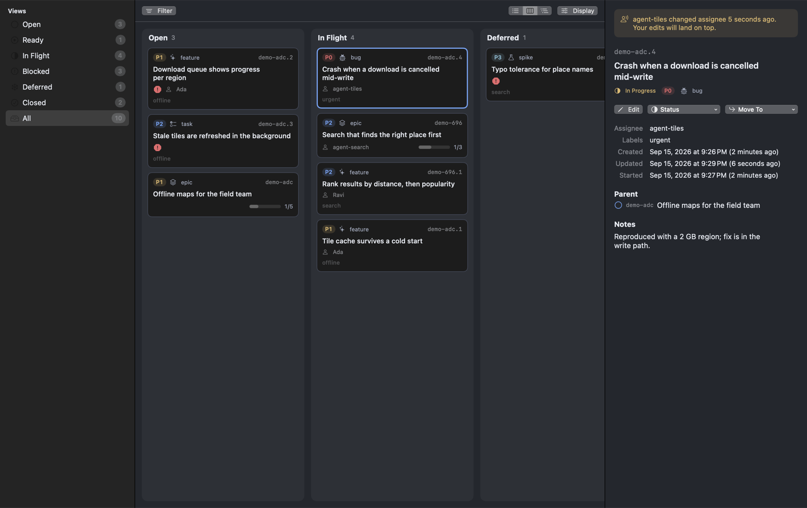
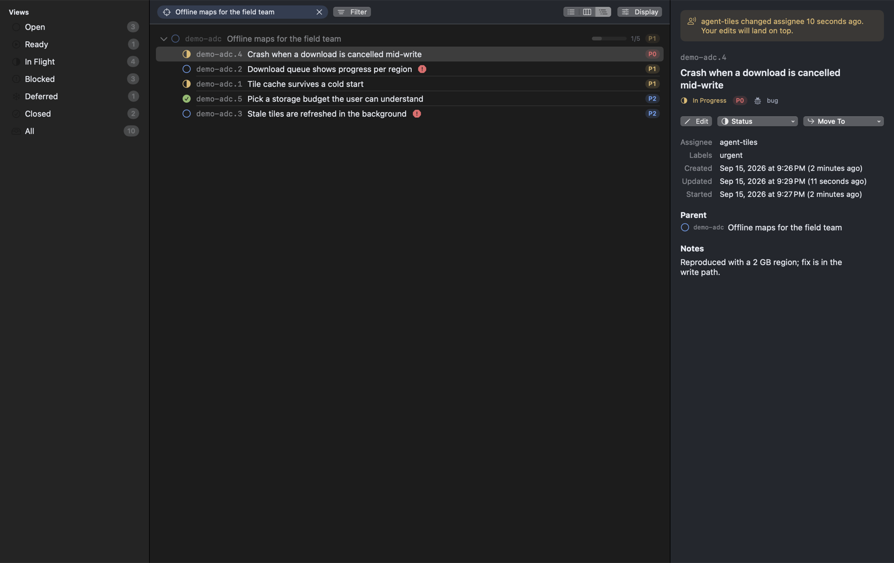
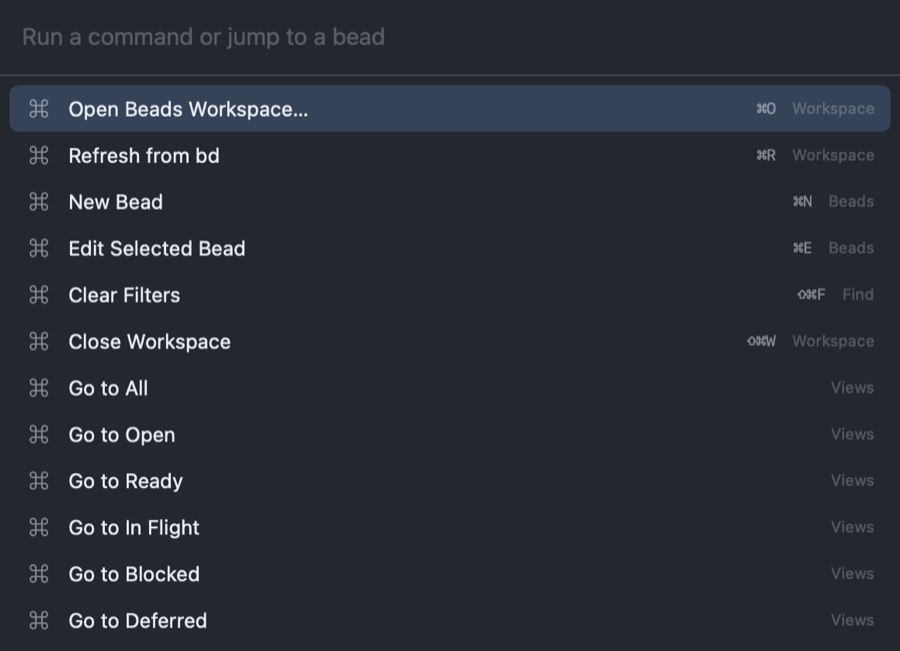
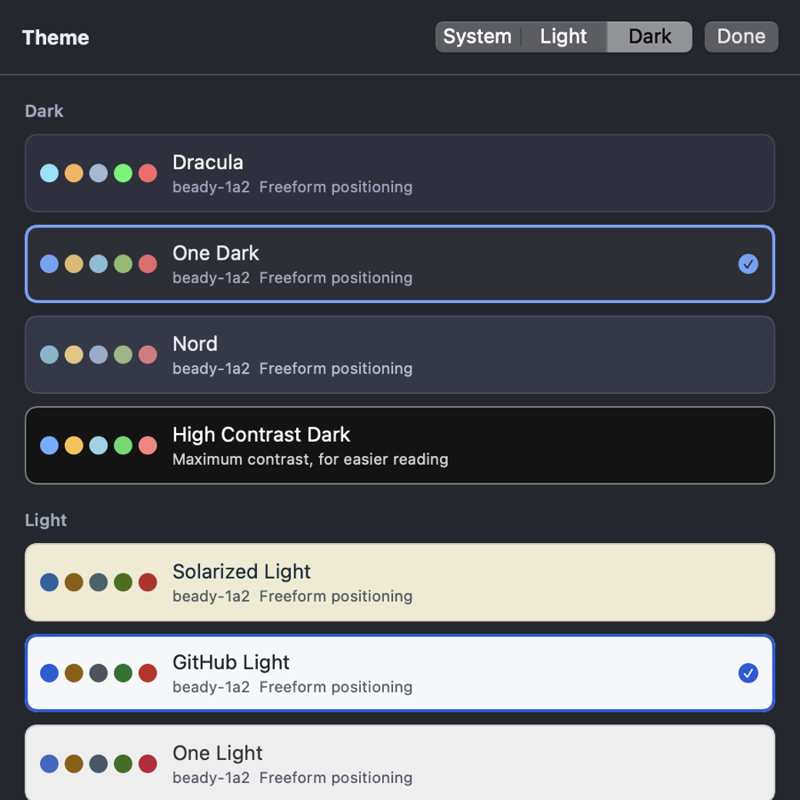
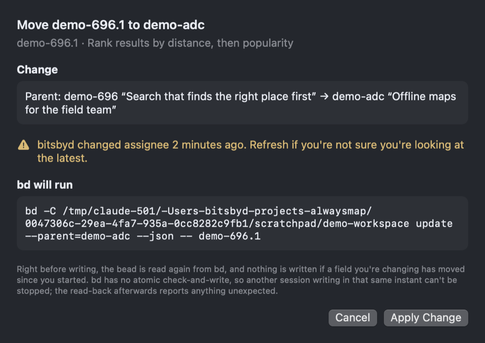

<h1 align="center">Beady</h1>

<p align="center">
  A native macOS app for seeing what a <a href="https://github.com/steveyegge/beads">beads</a>
  (<code>bd</code>) database is doing — and changing it without holding your breath.
</p>



Beads is an issue tracker built for agents: dependencies are first class, and several agents may
be writing to the same database while you read it. Beady is the window onto that. It reads with
`bd --readonly`, watches the database for changes so the view is never stale, and puts every write
behind validation, a preview of the exact `bd` commands, and a read-back check.

The screenshot above is Beady noticing that something else moved while you were looking: an agent
touched that bead four seconds ago, and the app says so rather than pretending it owns the data.

## What it's for

- **See the shape of the work.** Lifecycle views (Open, Ready, In Flight, Blocked, Deferred,
  Closed, All), each keeping its own filters, grouping, ordering and layout.
- **Filter the way you think.** Pick a property, tick values; rules read as chips —
  `Priority · is any of · P1, P2 · ✕` — and combine with AND.
- **Three ways to look.** A resizable table, a tree that keeps ancestors visible, and a board you
  can drag between.
- **Keep what matters in front of you.** Pin a bead (⇧⌘P) and it leads every list, tree and board
  column; star one (⇧⌘S) and it collects in the Starred view. Both are bd labels, so `bd list
  --label pinned` sees exactly what Beady sees. The mark appears at once and is written behind
  it — a bd write costs the better part of a second — and if the write fails the mark goes back
  and the Changes menu says why.
- **Ask what's in the way.** bd's "blocked" means something upstream has to land first, so Beady
  says so rather than sounding an alarm: a quiet waiting mark, a **Blocked by** column (on by
  default in the Blocked and Ready views) naming the blocker, and a details section with the chain
  grouped into "start now" and "then". ⌘G opens the same thing as a one-hop graph.
- **Change things carefully.** Nothing is written until you confirm a sheet showing the change,
  its warnings, and the commands themselves.

| | |
|---|---|
|  |  |
| Board — drag between columns; the grouping decides what a drop means | Tree — a bead's subtree, ancestors kept visible when a filter matches a child |

## Everything from the keyboard

`⌘P` runs any command or jumps to a bead by id or title. It answers to the words you'd actually
type: `fin` finds Find, `kanban` finds the board, `drac` finds the theme.



`/` search · `F` filter · `⇧V` display · `⌘T` theme · `⌘N` new bead · `⌘E` edit · `⌘G` graph ·
`⇧⌘P` pin · `⇧⌘S` star · `⌘I` details · `⌘1/2/3` layout · `⌘R` refresh · `?` the full list.

## Themes, and eyes that need help



System, light or dark, with the best-known editor themes on both sides — Dracula, One Dark, Nord,
Solarized Light, GitHub Light, One Light — plus a high-contrast pair that macOS's own
**Increase Contrast** setting switches to on its own. Text scales from Small to Extra Large.

⌘T opens the picker: arrow up and down and the whole app repaints as you go, so you judge a theme
by the app rather than by six coloured dots. **Apply** keeps the one you stopped on; Cancel or
Escape puts back what you had.

Every colour in the app is a design token, and the contrast of every theme is checked by tests:
body text clears WCAG AA (4.5:1) on both the background and a row, status and priority colours
clear 3:1, and the high-contrast themes clear AAA (7:1).

## Writing to a live database



bd has no lease or lock, and agents write whenever they like, so Beady is built to be one writer
among several:

- **Validation** against the loaded data — titles, priorities, known statuses and types, parents
  that exist, no parent loops. Closing needs a reason; bd's own rules (no closing pinned beads or
  epics with open children) are respected.
- **A conflict check** immediately before writing, comparing what you saw with what's in bd now.
- **The exact commands**, shown before you agree to them.
- **A read-back** afterwards. If anything goes wrong, the result is resolved into landed, failed or
  uncertain by re-reading — never guessed.
- **Live-work warnings.** If another actor touched a bead recently (bd's interaction log), the row
  is marked and the confirmation sheet says so. It informs; it never blocks, because a lock bd
  doesn't offer can't be faked.

## Install

Requirements: macOS 15 or later, and `bd` on your PATH.

**Build it yourself** — recommended, because an app you build is never quarantined. You also need
a Swift 6 toolchain, from Xcode or the Command Line Tools:

```bash
git clone https://github.com/dvhthomas/beady.git
cd beady
scripts/bundle.sh && open build/Beady.app
```

**Or download a release.** Take the zip from
[Releases](https://github.com/dvhthomas/beady/releases), unzip, and move Beady to /Applications.
It's ad-hoc signed but not notarised — there's no Apple Developer ID behind it — so macOS
quarantines it the first time. Either open it and choose **Open Anyway** in System Settings →
Privacy & Security, or clear the flag yourself:

```bash
xattr -dr com.apple.quarantine /Applications/Beady.app
```

Open a project folder containing `.beads` (or the `.beads` folder itself) with ⌘O. The last
workspace reopens on launch; `--workspace /path/to/project` overrides it.

## What you can see

- **Views** (sidebar, modelled on Linear, navigation only): Open, Ready (open and unblocked),
  In Flight, Blocked, Deferred, Closed and All, with each view's total. Categories come from `bd statuses`, so custom statuses
  land in the right place. Each view keeps its own filters, search, layout, grouping and ordering,
  so switching from Open to In Flight never carries Open's filters along.
- **Filter** (button or `F`, in the view header): pick a property, then tick values. The menu
  stays open, and each value shows how many issues you'd see. Rules appear as chips reading
  `Priority · is any of · P1, P2 · ✕`; click the operator to switch between `is` / `is not` (or
  `includes all / any / none` for labels), and the values to change them. Chips are ANDed, and a
  view's status options only include statuses that view can contain.
- **Display** (button or `⇧V`): layout (List, Board, Tree), grouping (Lifecycle, Status, Priority,
  Type, Assignee, Parent), ordering, and which columns the list shows.
- **Columns**: the list is a real table — drag the header dividers to resize, right-click the
  header (or use Display) to show and hide columns, including Labels and Progress. Your layout is
  saved between launches; **Reset Columns** puts it back.
- **Focus** (any row's context menu, or the details panel): points the whole view at everything
  under that bead, at any depth — for any bead, not just epics. A breadcrumb in the header names
  it, and its ✕ returns you to the view you came from.
- **Layouts**: List (a table with section headers per group), Board (a column per group, lifecycle
  when ungrouped), and Tree (parent/child outline, expanded by default, with completion;
  right-click to expand or collapse all).
- **Search** narrows the current view: every word must appear in the id, title, description,
  notes, labels or close reason.
  - Different facets are ANDed.
  - Within a single-valued facet (type, status, priority, assignee) the picked values are
    alternatives, because an issue has exactly one of each.
  - Labels are multi-valued, so every selected label is required.
  - Every search word must appear somewhere (id, title, description, notes, labels, close reason).
- **Tree context**: when a filter matches a child, its ancestors stay visible (dimmed) so nothing
  appears orphaned.
- **Details inspector**: metadata, parent / blocked-by / blocks / children links, description and
  notes (inline Markdown), close reason, the unblock path when something is in the way, and a
  **History** expander built from `bd history` — bd records a commit per change, so Beady diffs
  consecutive versions into "status · open → in_progress" and names the actor from bd's
  interaction log.
- **Pins and stars** are bd labels (`pinned`, `starred`), never app-only state. Note bd also has a
  built-in `pinned` *status*, which is a different thing: the label is Beady's "show me first".
- **Auto-refresh**: the app watches the `.beads` folder with FSEvents and reloads within a moment
  of any write — yours or an agent's — falling back to a 15-second check. Nothing is opened or
  written to do it. ⌘R reloads on demand.
- **Other sessions**: bd has no lease or lock, so when another actor changed a bead recently
  (from `.beads/interactions.jsonl`) the details panel says who and when, the row is marked, and a
  change to that bead carries a warning on the confirmation sheet. It informs; it never blocks.

## Architecture

```
Beady (app target)      SwiftUI views + AppSession composition root
   │            │
   ▼            ▼
BeadsPresentation   BeadsData     WorkspaceModel (per-view state) │ BDGateway + BDStore
        │               │
        └──────► BeadsCore ◄──────┘  Issue, IssueSnapshot, Scope, IssueFilter,
                                     IssueQuery, IssueTree, IssueBoard  (pure, no I/O)
```

- **BeadsCore** is the domain: the snapshot, lifecycle scopes, Linear-style view filtering
  (`ViewSource`, `FilterRule`, `ViewFilter`, `FilterOptions`, `IssueGrouping`), sorting, tree
  building (cycle-safe), and the change pipeline (`IssueChange`, `ChangeValidator`, `ChangeGuard`,
  `ChangeRunner`). It defines the single `BeadsStore` port.
- **BeadsData** implements that port. Every bd invocation is a typed `BDCommand` run by one
  `BDGateway`, which also owns the change token and workspace detection. Reads always carry
  `--readonly`; the only writes are `update`, `close`, `reopen` and `create`. `BDStore` implements
  `BeadsStore` purely through the gateway, and an architecture test keeps it that way. Underneath:
  locating `bd` (Finder-launched apps get a minimal PATH), non-blocking pipe draining, timeouts and
  cancellation that escalate SIGTERM to SIGKILL (bd traps SIGTERM), and per-record JSON decoding.
- **BeadsPresentation** holds all view state and decisions in a UI-framework-free `@Observable`
  model, so it's unit-tested without SwiftUI.
- **Beady** is thin SwiftUI plus the composition root.

### Why the bd CLI rather than reading Dolt directly

bd owns its storage: embedded or server Dolt, schema migrations, and derived fields (`parent`,
dependency types, status categories). Reading Dolt tables directly would couple the viewer to
bd's internal schema and need a MySQL-protocol client or the Dolt engine embedded in the app.
One `bd --readonly list --json --all --limit 0 --flat` returns the whole database (about 0.3s for
~70 issues), and all filtering happens in memory, which keeps the UI instant. The loader sits
behind a protocol, so a direct Dolt adapter can replace it later without touching the rest.

### Change detection

Polling every 2s compares a fingerprint of `.beads/last-touched`, `.beads/issues.jsonl` (mtime
and size) and Dolt's `noms` files (**size only**). Even `bd --readonly` bumps the mtime of Dolt's
manifest and journal, so mtimes there would make every reload trigger another. Data older than
five minutes is reloaded regardless, to cover writes the probe can't see (such as a remote Dolt
server).

## Tests

```bash
scripts/test.sh
```

Swift Testing, test-first per layer: domain rules, JSON decoding against realistic bd output, the
CLI loader with a fake runner (asserting it only ever runs `--readonly list` / `statuses`), the
process runner (pipe deadlocks, timeouts), and the presentation model (loading, change-driven
refresh, scope/filter/sort, chips, tree, board).

An opt-in integration test uses the real `bd` against an existing workspace, read-only, and checks
that reading doesn't register as a change:

```bash
BEADY_IT_WORKSPACE=/path/to/project scripts/test.sh
```

A second opt-in test writes through the real bd: it creates epics and a bead, edits it, moves it
between epics, confirms a loop is refused, closes and reopens it, and checks the result. It only
runs against a workspace containing a `.beady-scratch` marker file, so it can't touch a real
project:

```bash
BEADY_IT_WRITABLE_WORKSPACE=/path/to/scratch-project scripts/test.sh
```

`scripts/test.sh` also passes the Swift Testing macro plugin path when only the Command Line Tools
are installed, since SwiftPM doesn't find it on its own there. For the same reason (no SwiftUI
macro plugin in the Command Line Tools) the views use `State` as a plain stored property rather
than the `@State` macro.

## Not yet

Editing arbitrary labels, assignees and blocking dependencies; comments (`bd comments`); and
graphs wider than one hop around a bead.

## Developing

`scripts/test.sh` runs the suite (it passes the Swift Testing macro plugin path, which plain
`swift test` misses under Command Line Tools). Two opt-in integration suites run against a real
bd when you point them at one:

```bash
BEADY_IT_WORKSPACE=/path/to/project scripts/test.sh            # read-only
BEADY_IT_WRITABLE_WORKSPACE=/path/to/scratch scripts/test.sh   # writes; needs a .beady-scratch marker
```

`BEADY_SNAPSHOT_DIR=/tmp/shots build/Beady.app/Contents/MacOS/Beady --workspace <project>` renders
the main views to PNGs offscreen, which is how UI changes get checked without a window — the
screenshots above were made that way, from a small demo database.

`swift scripts/make-icon.swift` redraws `Resources/AppIcon.icns`.

This app's own work is tracked in beads — `bd list` in a clone of your own. The backlog
itself stays on the machine it's worked on; only bd's configuration is committed.

## Licence

MIT. See [LICENSE](LICENSE).
